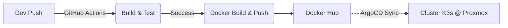

# 📡 MiniSense API - Desafio Técnico Backend (.NET 9)


API RESTful desenvolvida para gestão de dispositivos IoT e ingestão de sensoreamento remoto. O sistema gerencia o ciclo de vida de gateways (dispositivos), configura streams de dados e processa medições em tempo real.

## 📋 Entregável
Este projeto excede os requisitos funcionais, incorporando práticas avançadas de Engenharia de Software e DevOps:

* ✅ **Framework:** Implementação nativa em **.NET 9.0**.
* ✅ **Arquitetura:** Clean Architecture + Domain-Driven Design (DDD).
* ✅ **Infraestrutura:** Cluster Kubernetes proprietário (Self-Hosted).
* ✅ **GitOps:** Deploy automatizado via **ArgoCD**.
* ✅ **Qualidade:** Testes Unitários e Integração Contínua (CI).
* ✅ **Documentação:** Interface interativa via **Scalar**.

---

## ☁️ Infraestrutura & DevOps (Self-Hosted)

Diferente de soluções gerenciadas (como AKS ou EKS), o ambiente de produção deste projeto foi construído "do zero" para simular um cenário real de Edge Computing ou On-Premise.

### 1. Cluster Kubernetes (K3s no Proxmox)
A infraestrutura roda sobre um servidor **Proxmox VE**, onde provisionamos VM para formar um cluster Kubernetes leve e eficiente.
* **Orquestrador:** [K3s](https://k3s.io/) (Lightweight Kubernetes). Escolhido por ser ideal para ambientes IoT/Edge devido ao seu baixo consumo de recursos.
* **Virtualização:** Proxmox VE (Virtualizador).

### 2. GitOps com ArgoCD
A entrega contínua (CD) segue estritamente os princípios de GitOps. Não fazemos `kubectl apply` manual.
* **Ferramenta:** [ArgoCD](https://argoproj.github.io/cd/).
* **Fluxo:** O ArgoCD monitora o repositório Git (pasta `/k8s`). Qualquer alteração nos manifestos é detectada e sincronizada automaticamente com o cluster K3s, garantindo que o estado do cluster sempre reflita o código.

### 3. Pipeline de CI/CD



---

## 🚀 Como Rodar o Projeto (Local)

A maneira mais simples e recomendada de executar a aplicação é utilizando o **Docker Compose**, que orquestra a API e o Banco de Dados PostgreSQL automaticamente.

### Pré-requisitos
- [Docker](https://www.docker.com/) e Docker Compose instalados.

### Passo a Passo

1. Clone este repositório:
   ```bash
   git clone https://github.com/andrewqsantos/MiniSense.git
   cd MiniSense
   
2. Execute o build e suba os containers:
    ```bash
    docker-compose up --build

3. Aguarde alguns segundos. A aplicação estará disponível quando o terminal exibir que o container minisense-api está rodando.

   ```
   http://localhost:5284/
   ```

Nota: As migrações do banco de dados (Criação de tabelas e Seed de Unidades de Medida) são aplicadas automaticamente na inicialização da API.


---

## 📖 Documentação da API e Fluxo de Uso
A documentação interativa dos endpoints, incluindo contratos JSON, tipos de dados e ferramenta de teste ("Try it out"), está disponível via Scalar.

Após rodar o projeto, acesse em seu navegador:

👉 http://localhost:5284/scalar/v1

A API está estruturada para garantir a consistência dos dados, onde dispositivos pertencem a usuários e streams pertencem a dispositivos. Abaixo, o roteiro para testar o fluxo completo via Scalar ou Postman:

### 🗺️ Visão dos Endpoints

### 1. 👤 Usuários & Dispositivos (`UsersController`)
Gerencia a posse dos equipamentos.
* `GET /api/users/{userId}/devices`: Lista todos os dispositivos de um usuário.
* `POST /api/users/{userId}/devices`: Ponto de Entrada. Registra um novo dispositivo para o usuário.

### 2. 📟 Gestão do Dispositivo (`DevicesController`)
Gerencia a configuração e visualização agregada.
* `GET /api/devices/{key}`: Visão Dashboard. Retorna o dispositivo, streams ativas e últimas medições.
* `POST /api/devices/{key}/streams`: Adiciona uma nova capacidade de medição (ex: sensor de "Umidade").

### 3. 🌊 Streams & Dados (`StreamsController`)
Focado na ingestão de dados e histórico.
* `GET /api/streams/{key}`: Lista todas leituras (telemetria).
* `POST /api/streams/{key}/data`: Ingestão. Endpoint para receber as leituras (telemetria).

### 4. 📏 Unidades (`UnitsController`)
* `GET /api/measurement-units`: Catálogo de unidades (Celsius, Volts, etc).

---

## 🏗️ Arquitetura e Modelagem
O projeto segue os princípios da **Clean Architecture** e **DDD**:

| Camada         | Responsabilidade                                 | Tecnologias                                |
|----------------|--------------------------------------------------|--------------------------------------------|
| Domain         | Núcleo do negócio. Entidades ricas e validações. | C# Puro, Records, Exceptions customizadas. |
| Application    | Casos de uso e orquestração.                     | Services, DTOs, AutoMapper (manual).       |
| Infrastructure | Acesso a dados e implementações externas.        | EF Core 9, PostgreSQL, Mapas de Contexto.  |
| API            | Entrada HTTP e Apresentaçao                      | Controllers. Middelwares, DI.              |

### Destaques de Código
* **Rich Domain Model**: Entidades com `private set` e validação no construtor (Nada de classes anêmicas).
* **Primary Constructors**: Uso massivo de recursos do C# 12/13 para código mais limpo.
* **Testes Automatizados**: Cobertura de regras de negócio usando **xUnit**, **Moq** e **FluentAssertions**.

---

## 🏛️ Modelagem do Domínio (Domain Modeling)

A camada de domínio (`MiniSense.Domain`) foi projetada para ser o núcleo da aplicação, totalmente desacoplada de detalhes de infraestrutura, banco de dados ou frameworks externos. A modelagem seguiu os princípios do **Domain-Driven Design (DDD)** para garantir integridade e consistência das regras de negócio.

Abaixo, os pilares fundamentais adotados na implementação:

## 1. Modelo de Domínio Rico (Rich Domain Model)

Ao contrário de modelos anêmicos (que possuem apenas propriedades públicas e nenhuma lógica), as entidades do **MiniSense** possuem comportamento. Elas são responsáveis por validar seu próprio estado e executar regras de negócio.

> **Exemplo no Código (DataStream.cs)**
>
> O método `AddMeasurement()` não apenas adiciona um item à lista. Ele verifica a regra de negócio:
>
> **"Não é permitido adicionar medições a uma stream desabilitada".**
>
> Isso garante que a regra esteja **centralizada na própria entidade**, e não espalhada pelos *Services* ou *Controllers*, mantendo o domínio coeso e expressivo.

## 2. Encapsulamento e Proteção de Estado

Todas as propriedades das entidades utilizam `private set` ou coleções somente leitura (`IReadOnlyCollection`). Isso impede que agentes externos alterem o estado do objeto de forma inconsistente.

> **Listas Protegidas**
>
> A coleção `_measurements` é privada. O mundo externo só acessa `Measurements` (somente leitura).  
> Para adicionar dados, é obrigatório passar pelo método controlado `AddMeasurement`.

---

## 3. Validação de Invariantes (Defensive Programming)

As entidades são projetadas para **nunca existirem em um estado inválido**. A validação ocorre no momento da construção (Construtor).

> Se tentar criar uma `DataStream` com nome vazio, ID de dispositivo inválido ou unidade de medida inexistente, o construtor lança uma exceção imediatamente.
>
> Isso elimina a necessidade de checagens repetitivas em camadas superiores.

---

### Herança Base

Todas as entidades herdam de uma classe base `Entity`, garantindo consistência na estrutura de identificadores.
